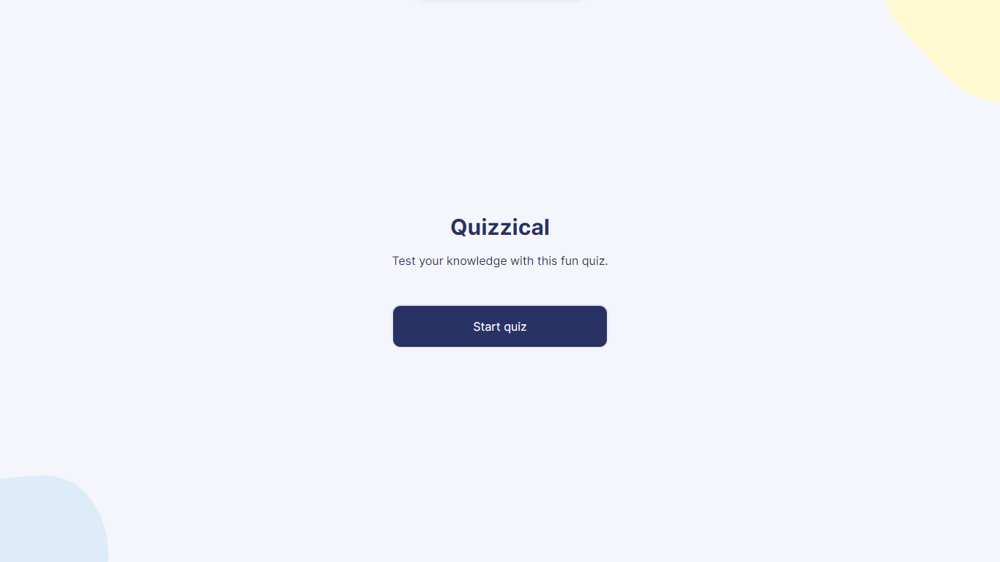

# Quizzical



## Overview

A simple quiz app that pulls questions from the [Open Trivia Database](https://opentdb.com/api_config.php) API.

## Table of contents

- [The challenge](#the-challenge)
- [Links](#links)
- [Built with](#built-with)
- [How to use](#how-to-use)
- [Continued development](#continued-development)
- [Author](#author)

### The challenge

Users should be able to:

- View the optimal layout for each of the website's pages depending on their device's screen size.
- See hover states for all interactive elements on the page.
- Recieve validations when they try to check answers without answering all questions.
- See the correct answers highlighted in the results page.

### Links

- [Visit Site](https://quizzicallyy.vercel.app/)

### Built with

- Semantic HTML5 markup
- Mobile-first workflow
- [Next.js](https://nextjs.org/docs) - React Framework
- Typescript
- [TailwindCSS](https://tailwindcss.com/docs)

### Continued development

- Add the option for users to configure the kind of questions they want to answer.
- Add a nice celebration feature if all questions are gotten right.

### How to Use

Clone this repository or download to your local machine

```bash
  git clone
```

Go to the project directory

```bash
  cd quizzically
```

Install dependencies

```bash
  npm install
```

Start the server

```bash
  npm run dev
```

Open [http://localhost:3000](http://localhost:3000) with your browser to see the result.

## Author

- Website - [Taqib](https://github.com/Dom-iha)
- Twitter - [Taqib](https://twitter.com/_Mihaq)
- Linkedin - [Taqib](https://www.linkedin.com/in/taqib-ibrahim)
